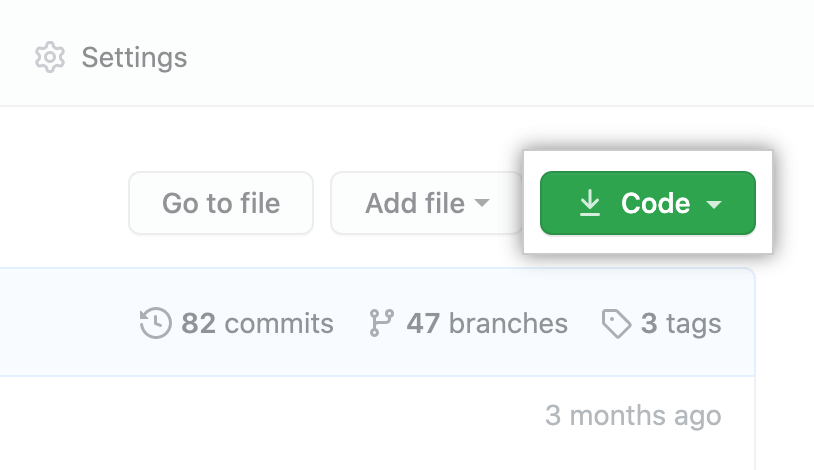

## How to Clone a Repository ?

When you create a repository on GitHub, it exists as a remote repository. You can clone your repository to create a local copy on your computer and sync between the two locations.

1.On GitHub, navigate to the main page of the repository.  
2.Above the list of files, click  Code.  
  
3.Under "Clone with HTTPS", copy the url in the box.  
4.Open Git Bash.(To install Git Bash,[Git Bash](https://git-scm.com/downloads))  
5.Change the current working directory to the location where you want the cloned directory.  
6.Type ```git clone```, and then paste the URL you copied earlier.  
```$ git clone https://github.com/YOUR-USERNAME/YOUR-REPOSITORY```  
7.Press Enter to create your local clone.For Example :  
```
$ git clone https://github.com/YOUR-USERNAME/YOUR-REPOSITORY
> Cloning into `Spoon-Knife`...
> remote: Counting objects: 10, done.
> remote: Compressing objects: 100% (8/8), done.
> remove: Total 10 (delta 1), reused 10 (delta 1)
> Unpacking objects: 100% (10/10), done.
```


