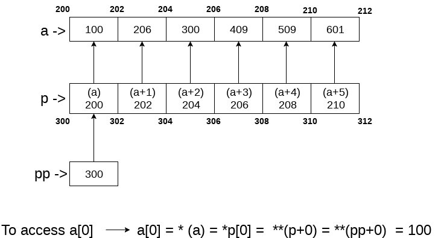

# **C Pointer to Pointer**

As we know that, a pointer is used to store the address of a variable in C. Pointer reduces the access time of a variable. However, In C, we can also define a pointer to store the address of another pointer. Such pointer is known as a double pointer (pointer to pointer). The first pointer is used to store the address of a variable whereas the second pointer is used to store the address of the first pointer. Let's understand it by the diagram given below.


Syntax:

```text
int **p; // pointer to a pointer which is pointing to an integer.   
```

Example:
```c
#include<stdio.h>  
void main (){  
    int a = 10;  
    int *p;  
    int **pp;   
    p = &a; // pointer p is pointing to the address of a  
    pp = &p; // pointer pp is a double pointer pointing to the address of pointer p  
    printf("address of a: %x\n",p); // Address of a will be printed   
    printf("address of p: %x\n",pp); // Address of p will be printed  
    printf("value stored at p: %d\n",*p); // value stoted at the address contained by p i.e. 10 will be printed  
    printf("value stored at pp: %d\n",**pp); // value stored at the address contained by the pointer stoyred at pp  
  }  
```

Output

```text
address of a: d26a8734
address of p: d26a8738
value stored at p: 10
value stored at pp: 10
```
## C double pointer example

Example:


As you can see in the above figure, p2 contains the address of p (fff2), and p contains the address of number variable (fff4).

```c
#include<stdio.h>  
int main(){  
    int number=50;      
    int *p;//pointer to int    
    int **p2;//pointer to pointer        
    p=&number;//stores the address of number variable      
    p2=&p;    
    printf("Address of number variable is %x \n",&number);      
    printf("Address of p variable is %x \n",p);      
    printf("Value of *p variable is %d \n",*p);      
    printf("Address of p2 variable is %x \n",p2);      
    printf("Value of **p2 variable is %d \n",*p);      
    return 0;  
  } 
```
Output
```text
Address of number variable is fff4
Address of p variable is fff4
Value of *p variable is 50
Address of p2 variable is fff2
Value of **p variable is 50
```

##  Q. What will be the output of the following program?

```c
#include<stdio.h>  
void main (){  
    int a[10] = {100, 206, 300, 409, 509, 601}; //Line 1  
    int *p[] = {a, a+1, a+2, a+3, a+4, a+5}; //Line 2  
    int **pp = p; //Line 3  
    pp++; // Line 4  
    printf("%d %d %d\n",pp-p,*pp - a,**pp); // Line 5  
    *pp++; // Line 6  
    printf("%d %d %d\n",pp-p,*pp - a,**pp); // Line 7  
    ++*pp; // Line 8  
    printf("%d %d %d\n",pp-p,*pp - a,**pp); // Line 9  
    ++**pp; // Line 10   
    printf("%d %d %d\n",pp-p,*pp - a,**pp); // Line 11  
  }  
```

  ## Explanation:


Output
```text
1 1 206
2 2 300
2 3 409
2 3 410
```